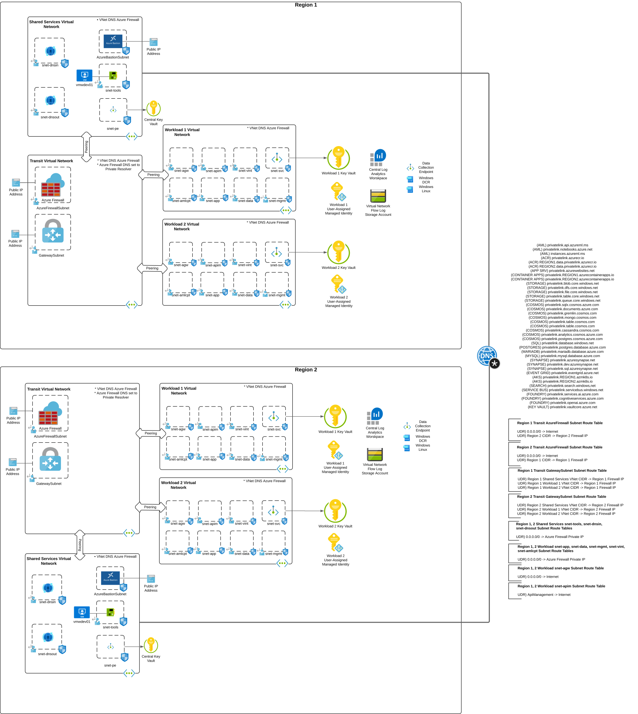

# Azure Hub and Spoke Lab with Azure Firewall and workload plugins
[](https://www.terraform.io/)
[](https://azure.microsoft.com/)
[](LICENSE)

## Table of Contents
- [Contributing](#contributing)
- [Updates](#updates)
- [Overview](#overview)
- [Architecture](#architecture)
- [Features](#features)
- [Prerequisites](#prerequisites)
- [Quick Start](#quick-start)
- [Configuration](#configuration)
- [Deployment](#deployment)
- [Post-Deployment](#post-deployment)
- [Security Considerations](#security-considerations)

## Contributing

* If you find code from here useful let me know! It's always wonderful to get feedback from peers in the field.
* If you incorporate this code into something you develop do me a favor and link the repository in your code or documentation.
* This code is written for my purposes and I'm sharing it in the hopes it will help some folks out there as they muck around with the Azure stack. 
* You may dislike the way I've done things here. That's ok. You code your way I'll code my way.
* Don't open issues that say "The code doesn't work." It's a pointless waste of your time and my time.
* If you open an issue, don't expect a fast response or fulfilling resolution to your issue. This is my off hours stuff that I do for fun and responding to issues is not fun.
* Sometimes I may break the lab or pieces of the lab. It will get fixed when I have time.
* Any executable scripts you see included are typically written for zsh or bash shell. If you're running them on Windows, you'll likely need to make changes to them.
* You can submit pull requests and I'll incorporate them if I think it makes sense and it aligns with the way I want to use this environment.

Hope any bit of this code helps save you some time or learn something new!

## Updates

### 2025
* **December 19, 2025**
  * Added updated [Microsoft Foundry workload](/workloads/microsoft-foundry/) plugin

* **November 14, 2025**
  * Added [AI Gateway workload](/workloads/ai-gateway/) plugin

* **October 17, 2025**
  * Added AML Hub workload
  * Added AML with VNet injection

* **October 8, 2025**
  * Added AI Foundry workload
    * Added support for CMK
    * Added support for Bing Grounding
    * Added support for external AOAI

* **September 29, 2025**
  * Removed from main repo to allow for smoother udpates
  * De-modularized for simplicity
  * Integrated DNS Security Policies into lab
  * Updated AzureRm and AzAPI

* **July 28, 2025**
  * Updated DNS security policies with new blocked domain configurations
  * Enhanced documentation with industry best practices
  * Improved README structure and content organization

* **March 17, 2025** *(Note: Date corrected from original typo)*
  * Added additional workload spoke for enhanced workload separation
  * Added dedicated subnet to support Azure Machine Learning injected compute scenarios
  * Expanded Private DNS Zones collection for additional Azure services
  * Enhanced support for AI/ML workloads with proper network isolation

### 2024
* **November 12, 2024**
  * Modified SSH ports from 22 to 2222 for enhanced security posture
  * Updated Network Security Group rules to reflect new SSH port configuration

* **October 28, 2024**
  * Extensive cleanup and optimization of IP address ranges for better resource utilization
  * Added comprehensive support for multi-region deployments
  * Improved network segmentation and routing logic

* **July 22, 2024**
  * Added dedicated subnets, route tables, and NSGs for Application Gateway deployment
  * Added dedicated subnets, route tables, and NSGs for API Management internal mode
  * Enhanced Azure Firewall rules to support internal API Management traffic flows
  * Improved support for application-tier networking components

* **June 7, 2024**
  * Initial release with core hub and spoke architecture
  * Basic Azure Firewall integration and network segmentation
  * Foundation security and monitoring components

## Overview
This Terraform configuration provisions an enterprise-like Azure lab environment built with a hub and spoke network architecture. Azure Firewall is used as a NVA (network virtual appliance) running in the hub virtual network. The lab environment is designed for learning, testing, and demonstrating enterprise networking patterns with Azure Firewall as the central security appliance.

### Key Benefits
- **Centralized Security**: All traffic flows through Azure Firewall for mediation and optional inspection
- **Network Architecture**: Hub and spoke model to mimic common enterprise environments and network security groups for microsegmentation
- **Core Functionality**: Includes extensive logging and integration with common built-in Azure infrastructure services
- **Multi-Region Support**: Optional deployment across two Azure regions for multi-region testing

## Architecture

The solution implements a **Hub and Spoke network topology** with the following design principles:

### Network Segmentation
- **Transit Resource Group**: Contains the hub virtual network with Azure Firewall
- **Shared Services Resource Group**: Contains DNS services, bastion, and tools servers
- **Workload Resource Group**: Available for common Azure workloads

### Traffic Flow
All network traffic (north-south, east-west) is routed through Azure Firewall in the hub, enabling:
- Centralized security policy enforcement
- Traffic filtering and optional inspection
- Traffic logging and monitoring

### Single Region Deployment


### Multi-Region Deployment
When both primary and secondary environments are defined in environment details, the solution deploys across two regions with:
- Region-specific hub and spoke networks configured for cross region routing
- Shared global Private DNS zones for cross-region resolution
- Consistent security policies across regions



## Features

### Security
- **Azure Firewall Standard**: Traffic mediation and optional inspection
- **DNS Security Policies**: Domain filtering and DNS query logging
- **Network Security Groups**: Granular subnet-level access controls
- **Private Endpoints**: Private connectivity to PaaS services
- **Key Vault Integration**: Centralized secrets management

### Network & Connectivity
- **Azure Private DNS Resolver**: Centralized DNS resolution
- **VPN Gateway**: Hybrid connectivity support
- **Multiple Workload Spokes**: Support multiple workloads in single deployment
- **Managed Infra-ready**: Subnets setup with NSGs and Route Tables to support common infrastructure like Application Gateway and APIM

### Monitoring & Logging
- **VNet Flow Logs**: Network traffic analysis and monitoring
- **Azure Monitor Integration**: Centralized logging and alerting
- **Traffic Analytics**: Visual insights into network patterns
- **Diagnostic Settings**: Service-level and data plane logs

### Management & Access
- **Azure Bastion**: Remote access
- **Windows Tools VM**: Pre-configured with Azure CLI, PowerShell, VS Code
- **Data Collection Rules**: Support for monitoring of VMs

## Prerequisites

### Azure Requirements
1. **Azure Subscription**: Active subscription with sufficient permissions
2. **Azure Permissions**: `Owner` role or equivalent delegated permissions for:
   - Resource group creation and management
   - Role assignment creation
   - Network resource provisioning

3. **Network Watcher**: Must be enabled in target regions using Azure Portal method
   - **Important**: Use Azure Portal, not CLI, to ensure proper naming (`NetworkWatcher_<region>`)
   - CLI creates resources with incorrect naming pattern that will cause deployment failures

### Local Development Environment
1. **Terraform**: Version 1.8.3 or higher
   ```bash
   terraform version
   ```

2. **Azure CLI**: Latest version recommended
   ```bash
   az version
   ```

3. **Git**: For cloning the repository
   ```bash
   git --version
   ```

### Required Information
Before deployment, gather the following:

1. **Key Vault Administrator Object ID**:
   ```bash
   az ad user show --id your-email@domain.com --query id --output tsv
   ```

2. **Trusted IP Address**: Your public IP for Key Vault firewall rules
   ```bash
   curl ifconfig.me
   ```

3. **Target Azure regions**: Primary and secondary (if using multi-region)

## Quick Start

### 1. Clone Repository
```bash
git clone <repository-url>
cd azure-terraform-lab-base-azfw
```

### 2. Configure Variables
Copy the example configuration:
```bash
cp terraform.tfvars-example terraform.tfvars
```

Edit `terraform.tfvars` with your values:

### 3. Deploy Infrastructure
```bash
# Initialize Terraform
terraform init

# Plan deployment
terraform plan

# Deploy with limited parallelism to avoid API limits
terraform apply -parallelism=3
```

## Configuration

### Network Design
The solution uses a supernet approach with these defaults:

| Component | Default CIDR | Purpose |
|-----------|--------------|---------|
| Cloud Supernet | `10.0.0.0/8` | Overall address space |
| Primary Region | `10.0.0.0/20` | Hub and spokes in primary region |
| Secondary Region | `10.0.16.0/20` | Hub and spokes in secondary region |
| On-premises | `192.168.0.0/16` | VPN site networks |

### Subnet Allocation
Each region automatically allocates subnets for:
- Azure Firewall subnet
- Gateway subnet
- Bastion subnet
- Application Gateway subnet
- API Management subnet
- Azure Machine Learning compute subnet
- Private endpoint subnet
- General workload subnets

### Private DNS Zones
The following zones are automatically created and linked:
- `privatelink.azurecr.io` - Container Registry
- `privatelink.database.windows.net` - SQL Database
- `privatelink.blob.core.windows.net` - Storage Account (Blob)
- `privatelink.vaultcore.azure.net` - Key Vault
- `privatelink.openai.azure.com` - Azure OpenAI
- `privatelink.api.azureml.ms` - Azure Machine Learning
- And many more...

## Deployment

### Standard Deployment
For basic single-region deployment:
```bash
terraform apply -parallelism=3
```


### Custom Parallelism
Azure ARM API has rate limits. Adjust parallelism based on your needs:
```bash
# Conservative (recommended for large deployments)
terraform apply -parallelism=1

# Standard (good balance)
terraform apply -parallelism=3

# Aggressive (only for small deployments)
terraform apply -parallelism=5
```

## Post-Deployment

### Verification Steps
1. **Check Resource Groups**: Verify all resource groups are created
2. **Test Connectivity**: Connect to Windows VM via Bastion
3. **Validate Firewall**: Check Azure Firewall logs in Log Analytics
4. **DNS Resolution**: Test private DNS resolution

### Initial Configuration
1. **Windows Tools VM**: Access via Bastion for management tasks
2. **Key Vault**: Retrieve admin credentials from the central Key Vault
3. **Monitoring**: Configure additional alerts in Azure Monitor

### Connecting Workloads
To add additional workloads:
1. Deploy resources in the workload resource group
2. Connect to the workload spoke subnets
3. Configure private endpoints for Azure services
4. Update firewall rules as needed

## Security Considerations

### Network Security
- All subnets have dedicated Network Security Groups
- Default deny-all rules with explicit allow rules
- Private endpoints for all Azure PaaS services
- No direct internet access from workload subnets

### Access Control
- Azure RBAC support for Azure Key Vault
- Bastion for secure VM access (no RDP/SSH over internet)
- Managed identities for service-to-service authentication

### Monitoring
- All network flows are logged
- Security events are forwarded to Log Analytics
- Traffic analytics provide visibility into communication patterns

### DNS Security
- DNS security policies to experiment with blocking malicious domains
- Private DNS resolution prevents data exfiltration
- DNS query logging for audit and forensics


