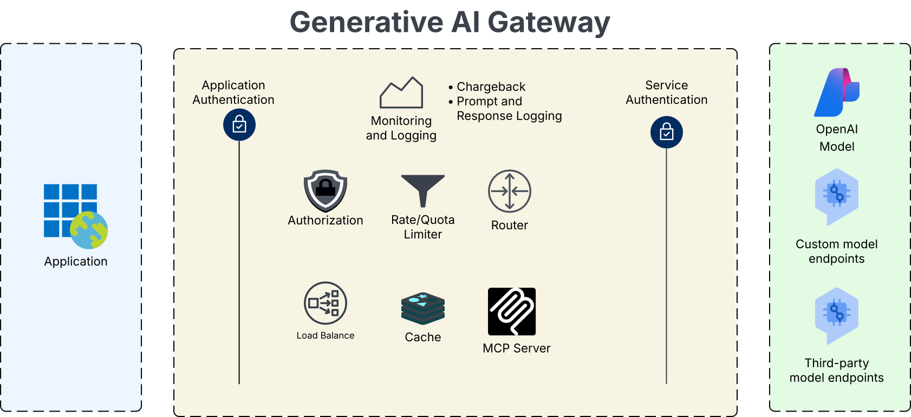
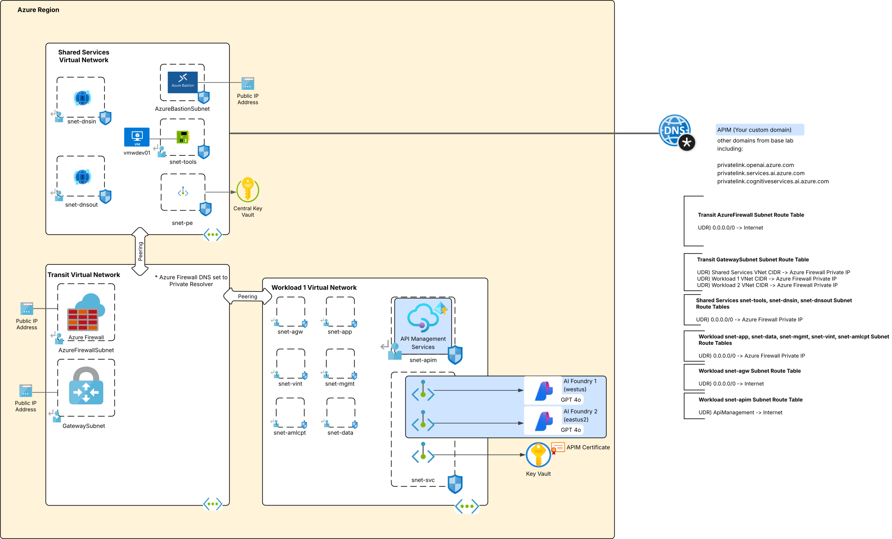
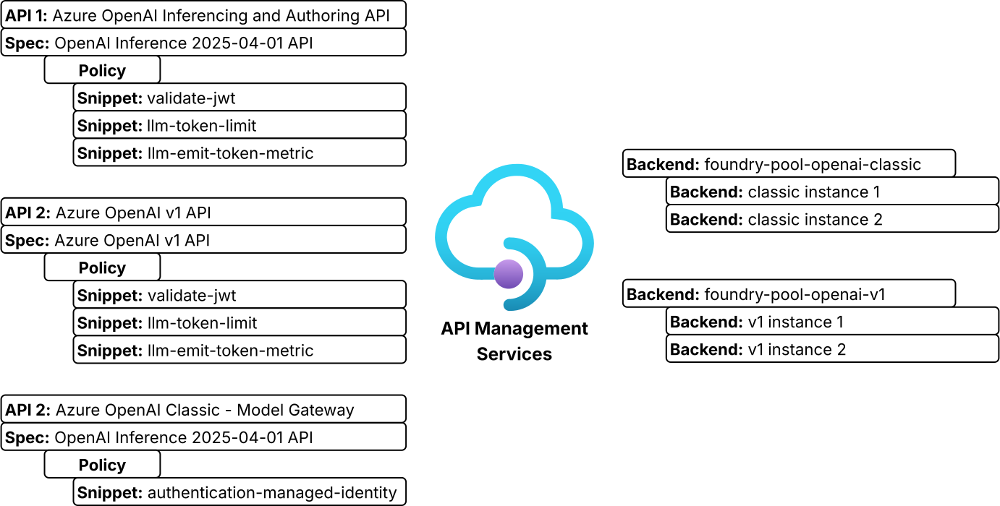
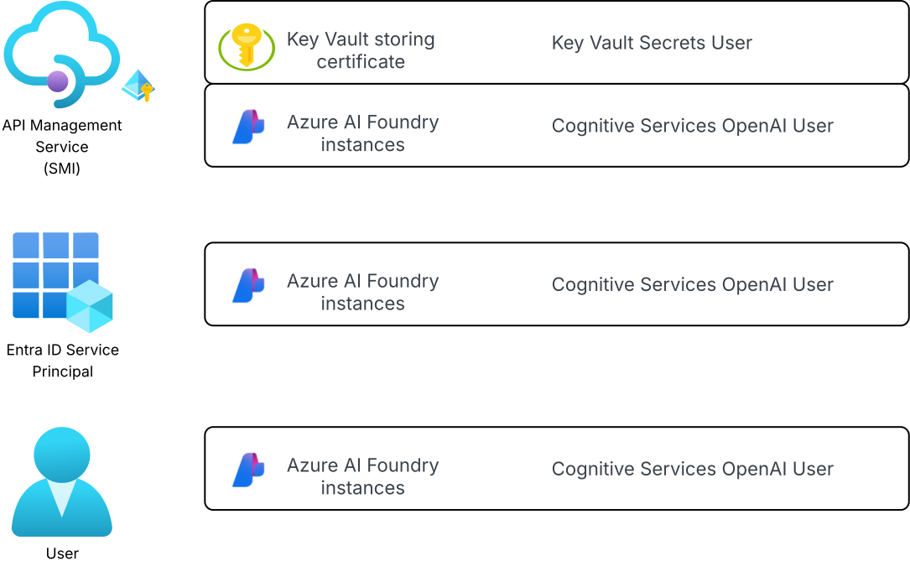

# API Management as an AI Gateway
[](https://www.terraform.io/)
[](https://azure.microsoft.com/)

## Table of Contents
- [Updates](#updates)
- [Overview](#overview)
- [Architecture](#architecture)
- [Features](#features)
- [Prerequisites](#prerequisites)
- [Quick Start](#quick-start)
- [Deployment](#deployment)
- [Post-Deployment](#post-deployment)


## Updates

### 2025
* **November 14th, 2025**
  * Initial release

## Overview
This Terraform code provisions an (APIM) API Management instance into the base lab environment to demonstrate the AI Gateway capabilities of APIM. It is deployed into a hub and spoke base lab environment (you must deploy the base lab first) using the v1 (AKA classic) Developer SKU deployed in internal mode configuration. Advanced logging is setup to capture prompts and responses sent through the AI Gateway.



## Architecture

The items pictured below in blue are deployed as part of this lab.



### API Management Setup
APIs are created for the [2024-10-21 Azure OpenAI inferencing and authoring APIs](https://github.com/Azure/azure-rest-api-specs/tree/main/specification/cognitiveservices/OpenAI.Authoring) and the [Azure OpenAI v1 API](https://github.com/Azure/azure-rest-api-specs/blob/main/specification/ai/data-plane/OpenAI.v1/azure-v1-v1-generated.json). A sample APIM policy is deployed for each API with commonly used API policy snippets.

Two AI Foundry instances are deployed with the OpenAI 4o model. These are deployed to West US and East US 2. These instances are configured as backends for the APIs with circuit breaker logic. A pooled backend is created to contain these two backends.



### RBAC
Azure RBAC is configured so multiple types of authentication flows can be tested including authentication offloading, OAuth client credentials flow, and OAuth on-behalf-of.



## Features

### Security
- **APIM in Internal Mode**: Traffic to and from APIM remains within virtual network
- **Entra ID Authentication**: APIM policy snippet is used to enforce Entra ID authentication to AI Foundry backends
- **Private Endpoints**: Private connectivity to PaaS services
- **Key Vault Integration**: APIM uses certificate sourced from Azure Key Vault for configuration of custom domains

### Network & Connectivity
- Azure Firewall and Network Security Groups are pre-configured to support internal mode APIM.

### Monitoring & Logging
- **Azure Monitor Integration**: Centralized logging and alerting
- **Prompt and Response Logging**: [APIM prompt and response logging is enabled](https://journeyofthegeek.com/2025/05/27/generative-ai-in-azure-for-the-generalist-prompt-and-response-logging-with-api-management/)
- **Diagnostic Settings**: Service-level and data plane logs are setup for all resources

## Prerequisites

### Azure Requirements
1. **Azure Subscription**: Active subscription with sufficient permissions
2. **Azure Permissions**: `Owner` role or equivalent delegated permissions for:
   - Resource group creation and management
   - Role assignment creation
   - Network resource provisioning

3. **Base Lab**: You must have already deployed the base lab.

### Local Development Environment
1. **Terraform**: Version 1.8.3 or higher
   ```bash
   terraform version
   ```

2. **Azure CLI**: Latest version recommended
   ```bash
   az version
   ```

3. **Git**: For cloning the repository
   ```bash
   git --version
   ```

### Required Information
Before deployment, gather the following:

1. **APIM DNS Namespace**: You must choose a custom DNS namespace for your APIM. This will be used to configure the custom domains for the APIM.

2. **Certificate in PFX format**: You must upload a certificate to the workload Key Vault that will be used to configure the [APIM custom domains](https://learn.microsoft.com/en-us/azure/api-management/configure-custom-domain?tabs=custom).

3. **Entra ID Tenant ID**: This is used by APIM policy to validate Entra ID access tokens sent to the AI Gateway.

4. **Service Principal Principal ID**: This is the principal id (object id) of the service principal you have already created. This will allow for testing of the client credentials flow.

5. **User Entra ID object ID**: This user is granted the Cognitive Services OpenAI User role on the AI Foundry instances to allow for testing on-behalf-of flows.

## Quick Start

### 1. Clone Repository
```bash
git clone <repository-url>
cd azure-terraform-lab-base-azfw/workloads/ai-gateway
```

### 2. Configure Variables
Copy the example configuration:
```bash
cp terraform.tfvars-example terraform.tfvars
```

Edit `terraform.tfvars` with your values. Ensure you read the description of the variables to understand the use. Many of these variables will draw from values of existing resources you delpoyed with the base lab.

### 3. Deploy Infrastructure
```bash
# Initialize Terraform
terraform init

# Plan deployment
terraform plan

# Deploy with limited parallelism to avoid API limits
terraform apply -parallelism=3
```

## Deployment

### Standard Deployment
For deployment:
```bash
terraform apply
```

## Post-Deployment

Once fully deployed you can use the [Jupyter notebook code sample](./sample-code/notebook.ipynb) provided in this repository. You need to manually import the authoring API for now. When I get around to it, I'll merge the two API specs.
