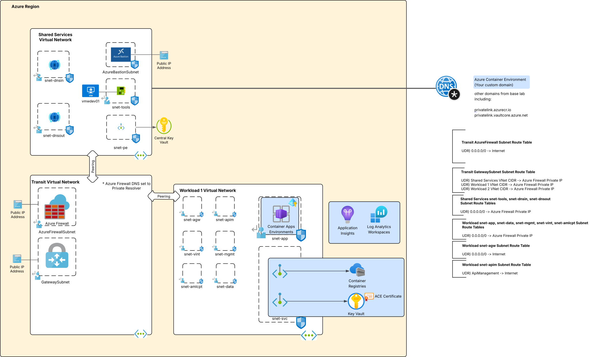

# Azure Container Apps Environment
[](https://www.terraform.io/)
[](https://azure.microsoft.com/)

## Table of Contents
- [Updates](#updates)
- [TODOS](#TODOS)
- [Overview](#overview)
- [Architecture](#architecture)
- [Features](#features)
- [Prerequisites](#prerequisites)
- [Quick Start](#quick-start)
- [Deployment](#deployment)
- [Post-Deployment](#post-deployment)

## TODOS
  * 3/27/2026 - Create an Azure Firewall rule collection for ACA

## Updates

### 2026
* **March 27, 2026**
  * Initial release

## Overview
This Terraform code provisions an Azure Container Apps Environment into the base lab environment included in this repository to demonstrate a network restricted Azure Container Apps deployment. It is deployed with [no inbound access from the public Internet](https://learn.microsoft.com/en-us/azure/container-apps/networking#accessibility-level) and [integrated with the virtual network](https://learn.microsoft.com/en-us/azure/container-apps/custom-virtual-networks?tabs=workload-profiles-env) to restrict Container Apps to internal access through the customer virtual network only.

The Container Apps Environment can be [created with a custom domain](https://learn.microsoft.com/en-us/azure/container-apps/environment-custom-dns-suffix) instead of the default domain. The Terraform ACME providers are used to source certificates from Let's Encrypt. The CloudFlare provider is used to register the required records to verify the domain. You'll need to set that stuff up for yourself if you want to use it. Otherwise, you can use the certificate and default domain name Microsoft provisions.

## Architecture

The items pictured below in blue are deployed as part of this lab.



## Features

### Security
- **Container Apps Environment with no public access**: Traffic from the public Internet is blocked
- **Container Apps with no public access**: Traffic from the public Internet to Container Apps deployed to the environment is blocked
- **Container Apps outbound traffic is mediated and inspected**: Traffic from the Container Apps destined to the Internet is routed through the Azure Firewall
- **Azure Container Registration**: Azure Container Registry created if you want to push or pull images
- **Key Vault Integration**: (Optional) Certificate sourced from Let's Encrypt is stored in Key Vault

### Network & Connectivity
- Outbound traffic is mediated and inspected by Azure Firewall. Intra-subnet traffic is mediated by Network Security Groups.

### Monitoring & Logging
- **Azure Monitor Integration**: Logs and diagnostics are turned on for all resources and are set to an Azure Log Analytics Workspace.

## Prerequisites

### Azure Requirements
1. **Azure Subscription**: Active subscription with sufficient permissions
2. **Azure Permissions**: `Owner` role or equivalent delegated permissions for:
   - Resource group creation and management
   - Role assignment creation
   - Network resource provisioning

3. **Base Lab**: You must have already deployed the [base lab](../../README.md).

### Local Development Environment
1. **Terraform**: Version 1.8.3 or higher
   ```bash
   terraform version
   ```

2. **Azure CLI**: Latest version recommended
   ```bash
   az version
   ```

3. **Git**: For cloning the repository
   ```bash
   git --version
   ```

### Required Information
Before deployment gather the following:

1. The subnet in the workload virtual network that will be delegated to the Azure Container Apps Environment. This subnet must be delegated to Microsoft.App/environments.
2. The subnet in the workload virtual network that where Private Endpoints will be created.

### Optional Information
If you want to dynamically provision a certificate for a custom domain, setup the following:

1. A public domain namespace you'll use for the Container Apps Environment.
2. DNS hosting for the domain in Cloudflare and an API token for Cloudflare that allows for management of DNS records.
3. A RSA private key in PEM format stored as a Key Vault secret.

## Variables

### Required Variables

| Variable | Type | Description |
|----------|------|-------------|
| `region` | `string` | The name of the Azure region to provision the resources to |
| `region_code` | `string` | The code of the Azure region to provision the resources to |
| `purpose` | `string` | The three character purpose of the resource |
| `random_string` | `string` | The random string to append to the resource name (alphanumeric, 6 characters or less) |
| `resource_group_name_dns` | `string` | The name of the resource group where the Private DNS Zones exist |
| `subnet_id_aca` | `string` | The resource id of the subnet that has been delegated for Azure Container Environments |
| `subnet_id_svc` | `string` | The resource id of the subnet where Private Endpoints will be deployed |
| `subscription_id_infrastructure` | `string` | The subscription where the Private DNS Zones are located |
| `tags` | `map(string)` | The tags to apply to the resource |
| `trusted_ip` | `string` | The trusted IP address of the Terraform deployment server. Used for Network Security Perimeter access rules when deploying from outside the virtual network |

### Optional Variables

| Variable | Type | Default | Description |
|----------|------|---------|-------------|
| `aca_environment_domain_name` | `string` | `null` | Populate this attribute if you're provisioning the Azure Container Apps Environment with a custom domain using the workflow built into this template|
| `cloudflare_api_token` | `string` | `null` | The API token for your Cloudflare account that can modify DNS records in the custom domain you are using the Azure Container Apps Environment|
| `letsencrypt_account_key` | `object` | `null` | The Key Vault resource secret id that contains the PEM encoded private key to use for the Let's Encrypt account |
| `letsencrypt_account_email` | `string` | `null` | The email address to use for the Let's Encrypt account |

## Quick Start

### 1. Clone Repository
```bash
git clone <repository-url>
cd azure-terraform-lab-base-azfw/workloads/azure-container-apps
```

### 2. Configure Variables
Copy the example configuration:
```bash
cp terraform.tfvars-example terraform.tfvars
```

Edit `terraform.tfvars` with your values. Ensure you read the description of the variables to understand the use. Many of these variables will draw from values of existing resources you delpoyed with the base lab.

### 3. Deploy Infrastructure
```bash
# Initialize Terraform
terraform init

# Plan deployment
terraform plan

# Deploy with limited parallelism to avoid API limits. You can tweak this however you want.
terraform apply -parallelism=3
```

## Deployment

### Standard Deployment
For deployment:
```bash
terraform apply
```

## Post-Deployment
Once everything is fully deployed you can begin deploying Container Apps to the environment.
