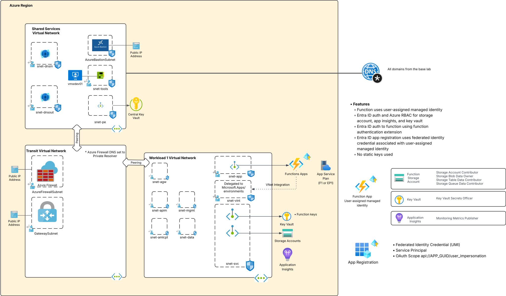

# Azure Function Apps
[](https://www.terraform.io/)
[](https://azure.microsoft.com/)

## Table of Contents
- [Updates](#updates)
- [TODOS](#TODOS)
- [Overview](#overview)
- [Architecture](#architecture)
- [Features](#features)
- [Prerequisites](#prerequisites)
- [Quick Start](#quick-start)
- [Deployment](#deployment)
- [Post-Deployment](#post-deployment)

## TODOS
* 6/2026 - Update NSPs to enforced mode when NSP links becomes GA

## Updates

### 2026
* **July 31st, 2026**
  * Swapped NSP resources to azurerm from azapi
  * Added support for Elastic Premium SKU in addition to Flexibile Consumption
  * Updated azurerm provider to 5.0.1 and azapi to 2.11.0
* **June 27th, 2026**
  * Initial release

## Overview
This Terraform code provisions an Azure Function App into the base lab environment included in this repository to demonstrate security features of Azure Functions. It is deployed network controls to manage inbound and outbound traffic. Identity controls ensure a managed identity is used when the Function needs to access other resources. Function keys are stored securely. Lastly, the Function is secured by Entra ID authentication.

The templates are built to support Function App plans of Flexible Consumption and Elastic Premium. It may work with App Service Premium plans, but I haven't tested it.

## Architecture

The items pictured below in blue are deployed as part of this lab.



## Features

### Neat stuff
* Optional support for [Azure Functions MCP Server Extension](learn.microsoft.com/en-us/azure/azure-functions/functions-bindings-mcp?pivots=programming-language-python)

### Security
* Function [uses user-assigned managed identity](https://learn.microsoft.com/en-us/azure/app-service/overview-managed-identity?tabs=portal%2Chttp)
* Entra ID authentication and Azure RBAC authorization to [Storage Account](https://learn.microsoft.com/en-us/azure/azure-functions/manage-connections?tabs=host%2Ccsharp&pivots=functions-auth-identity), Key Vault, and [Application Insights](https://learn.microsoft.com/en-us/azure/azure-monitor/app/azure-ad-authentication?tabs=aspnetcore)
* Built-in authentication to Function configured to [support Entra ID authentication](https://learn.microsoft.com/en-us/azure/app-service/overview-authentication-authorization#reasons-to-use-built-in-authentication)
* Application registration (and supporting service principal) configured to support Entra authentication and has an available scope of user_impersonation to support delegated user use cases such as MCP Server use case
* Application registration configured with [federated identity credential using user-assigned managed identity of the Function](https://learn.microsoft.com/en-us/entra/workload-id/workload-identity-federation-config-app-trust-managed-identity?tabs=microsoft-entra-admin-center%2Cdotnet)
* Public network disabled to Function and traffic restricted to Private Endpoint
* Function keys are [stored in Azure Key Vault as secrets](https://techcommunity.microsoft.com/blog/azureinfrastructureblog/storing-azure-function-keys-in-key-vault-using-user-assigned-managed-identity/4387877)

### Network & Connectivity
* [Outbound traffic is mediated and inspected](https://learn.microsoft.com/en-us/azure/azure-functions/functions-networking-options?tabs=azure-portal&pivots=flex-consumption-plan#virtual-network-integration) by Azure Firewall. Intra-subnet traffic is mediated by Network Security Groups.
* Traffic from the Function to Storage and Key Vault over Private Endpoints
* Storage Account and Key Vault use service firewall to restrict public network access to a trusted IP
* Network Security Perimeters in learning mode configured around Storage Account and Key Vaults for logging benefits

### Monitoring & Logging
* All resources configured to resource logs to a Log Analytics Workspace
* Function configured to send application logs and metrics to Application Insights

## Prerequisites

### Azure Requirements
1. **Azure Subscription**: Active subscription with sufficient permissions
2. **Azure Permissions**: `Owner` role or equivalent delegated permissions for:
   - Resource group creation and management
   - Role assignment creation
   - Network resource provisioning
3. **Base Lab**: You must have already deployed the [base lab](../../README.md).
4. You must delegate a subnet in the workload virtual network to Microsoft.Web/serverFarms to support regional vnet integration for
   the Azure Function.

### Local Development Environment
1. **Terraform**: Version 1.10.0 or higher
   ```bash
   terraform version
   ```

2. **Azure CLI**: Latest version recommended
   ```bash
   az version
   ```

3. **Git**: For cloning the repository
   ```bash
   git --version
   ```

### Required Information
Before deployment gather the following:

*  A subnet in the workload virtual network must be delegated to Microsoft.Web/serverFarms to support regional vnet integration for the
   Azure Function.

## Variables

### Required Variables

| Variable | Type | Default | Description |
|----------|------|--------|-------------|
| `function_plan_sku` | `string` | `FC`|  The function plan to use for the App Service Plan. This can be FC1 or EC1. |
| `mcp_server_enabled` | `bool` | `false` | Set this to true if you are deploying and MCP Server and want to use the [Function MCP Server extension](https://learn.microsoft.com/en-us/azure/azure-functions/functions-bindings-mcp?pivots=programming-language-python) |
| `python_version` | `string` | `3.13`|  The version of Python the application will use. By default it's set to 3.13 |
| `random_string` | `string` | | The random string to append to resources |
| `region` | `string` | | The name of the Azure region to provision the resources to |
| `region_code` | `string` | | The code of the Azure region to provision the resources to |
| `resource_group_name_dns` | `string` | | The name of the resource group where the Private DNS Zones are stored |
| `subnet_id_app` | `string` | | The resource id of the subnet where the Private Endpoint for the Function App will be deployed |
| `subnet_id_svc` | `string` | | The resource id of the subnet where Private Endpoints for supporting resources will be deployed |
| `subnet_id_vint` | `string` | | The ID of the subnet that has been delegated to Microsoft.Web/serverFarms for regional VNet integration for outbound traffic from the Azure Function |
| `subscription_id_infrastructure` | `string` | | The subscription ID where the Private DNS Zones are deploeyd to. This is the GUID not the full resource id |
| `tags` | `map(string)` | | The tags to apply to the resource |
| `trusted_ip` | `string` | | The IP address that will be granted access to the Azure Storage Account and Key Vault through the public IP. In my environment this is the machine I deploy my Terraform code from |

## Quick Start

### 1. Clone Repository
```bash
git clone <repository-url>
cd azure-terraform-lab-base-azfw/workloads/azure-functions
```

### 2. Configure Variables
Copy the example configuration:
```bash
cp terraform.tfvars-example terraform.tfvars
```

Edit `terraform.tfvars` with your values. Ensure you read the description of the variables to understand the use. Many of these variables will draw from values of existing resources you delpoyed with the base lab.

### 3. Deploy Infrastructure
```bash
# Initialize Terraform
terraform init

# Plan deployment
terraform plan

# Deploy with limited parallelism to avoid API limits. You can tweak this however you want.
terraform apply -parallelism=3
```

## Deployment

### Standard Deployment
For deployment:
```bash
terraform apply
```

## Post-Deployment
Once everything is fully deployed you can begin deploying code to the Function App.

### Elastic Premium Plans
If you're deploying to an Elastic Premium plan, you need to [deploy from a package file](https://learn.microsoft.com/en-us/azure/azure-functions/run-functions-from-deployment-package). This is required because the storage account used by the function in this deployment does not support storage access keys and is restricted to Entra ID authentication. Azure Functions does not support Entra ID authentication to Azure Files so 
