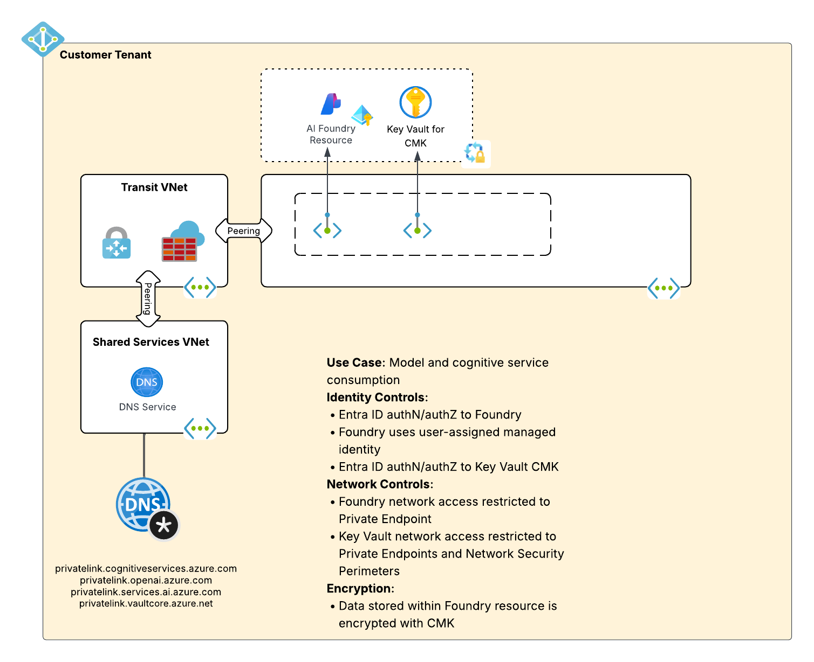
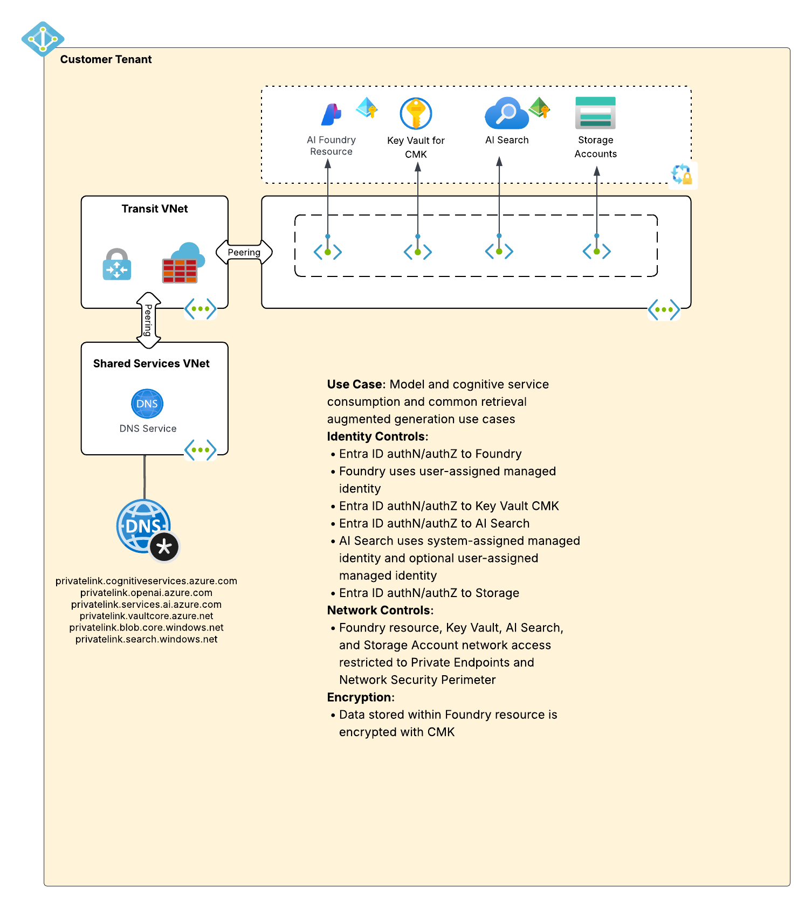
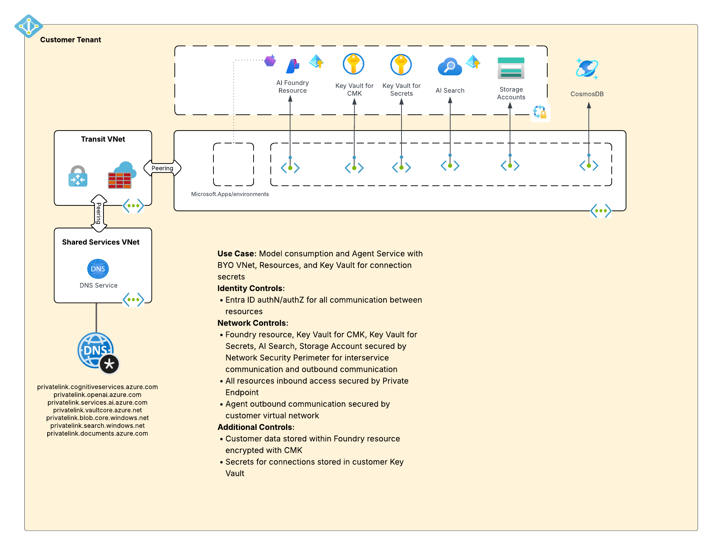

# Microsoft Foundry Workload

## Description

This Terraform can be used in combiantion with the [base lab](../../README.md) to provision a lab environment to experiment with different Microsoft Foundry designs and architectures. Use cases for this lab include:

1. Demonstrating basic consumption of Microsoft AI Services or models deployed to Foundry.
2. Demonstrating retrieval augmented generation (RAG) capabilities of AI Search.
3. Demonstrating the agent service deployed in a [standard agent configuration](https://learn.microsoft.com/en-us/azure/ai-foundry/agents/concepts/standard-agent-setup?view=foundry-classic).

AI was used to help with the format of this README file so if there is an issue blame the many threads of bad Stackoverflow answers and subpar Git repos it scraped during training.

## Table of Contents

- [Updates](#updates)
- [TODOS](#todos)
- [Limitations](#limitations)
- [Architectures](#architectures)
- [Features](#features)
- [Prerequisites](#prerequisites)
- [Variables](#variables)
- [Quick Start](#quick-start)
- [Usage](#usage)

## Updates
* **12/29/2025**
  * Initial release

## TODOS
* Add support for managed vnet model for agents after testing
* Add support for APIM connectivity after testing

## Limitations
* 12/25 - Foundry with UMIs for CMK is available in a limited set of regions
* 12/25 - AI Search must use an SMI when interacting with storage account in same region
* 12/25 - AI Search must use SMI when using import data wizard and setting Foundry resource for vectorization
* 12/25 - Foundry resource must support local authentication in order to use AzureOpenAIEmbedding skillset
* 12/25 - CosmosDB support for Network Security Groups is still preview
* 12/25 - Usage of Key Vault for storage of connection secrets require a project first be created before creating the resource-level connection
* 12/25 - Key Vault used for secrets storage cannot be placed in Network Security Perimeter due to an issue with secrets API calls and the usage of Network Security Perimeters

## Architectures
This lab supports variations of the three architectures seen below.

### Standalone


### RAG Demo


### Standard Agent


## Features
* Entra ID authentication and Azure RBAC authorization used where available
* Private Endpoints to secure inbound traffic from users and standard agents
* Network Security Perimeter usage to secure inbound and outbound traffic between PaaS resources
* Agent outbound traffic is controlled using VNet injection
* Option to demonstrate customer-managed key encryption for Foundry resource
* Option to demonstrate user-assigned managed identities with Foundry resources and projects
* Option to demonstrate BYO Key Vault for Foundry connection secrets
* Option to demonstrate helpful functionalities of AI Search for common RAG use cases

## Prerequisites

### Azure Resources
1. **Azure Subscription**: Active subscription with sufficient permissions
2. **Azure Permissions**: `Owner` role or equivalent delegated permissions for:
   - Resource group creation and management
   - Role assignment creation
   - Network resource provisioning
3. **Base Lab**: You must have already deployed the [base lab](../../README.md).

### Local Development Environment
1. **Terraform**: Version 1.8.3 or higher
   ```bash
   terraform version
   ```

2. **Azure CLI**: Latest version recommended
   ```bash
   az version
   ```

3. **Git**: For cloning the repository
   ```bash
   git --version
   ```

### Required Information
Before deployment, gather the following:

**User Entra ID object ID**: This user is granted various roles to perform common activities that would typically fall under an AI Engineer persona. The exact permissions depend architecture deployed.

## Variables

### Required Variables

| Variable | Type | Description |
|----------|------|-------------|
| `region` | `string` | The name of the Azure region to provision the resources to |
| `region_code` | `string` | The code of the Azure region to provision the resources to |
| `purpose` | `string` | The three character purpose of the resource |
| `random_string` | `string` | The random string to append to the resource name (alphanumeric, 6 characters or less) |
| `resource_group_name_dns` | `string` | The name of the resource group where the Private DNS Zones exist |
| `subscription_id_infrastructure` | `string` | The subscription where the Private DNS Zones are located |
| `subnet_id_private_endpoints` | `string` | The subnet id to deploy the private endpoints to |
| `user_object_id` | `string` | The Entra ID object id of the user account that should be granted permissions for an AI Engineer-like persona |
| `tags` | `map(string)` | The tags to apply to the resource |
| `trusted_ip` | `string` | The trusted IP address of the Terraform deployment server. Used for Network Security Perimeter access rules when deploying from outside the virtual network |

### Optional Variables

| Variable | Type | Default | Description |
|----------|------|---------|-------------|
| `agents` | `bool` | `false` | Set to true to provision the resources necessary for experimenting with a standard agent configuration. Set to false for standalone or RAG demo deployments |
| `agent_service_outbound_networking` | `object` | `{ type = "none" }` | Configuration for agent service outbound networking. Type must be `vnet_injection`, `managed_virtual_network`, or `none`. When using `vnet_injection`, `subnet_id` must be provided |
| `deploy_key_vault_connection_secrets` | `bool` | `false` | Set to true to create an Azure Key Vault to store secrets for connections used by agents. Only applicable when `agents = true` |
| `deploy_rag_resources` | `bool` | `false` | Set to true to provision the resources and permissions to experiment with AI Search's indexes, indexers, and skillset capabilities useful for common RAG patterns |
| `external_openai` | `object` | `null` | Configuration for using models deployed to an existing Azure OpenAI Service instance. Object should contain: `name`, `endpoint`, `resource_id`, and `region` |
| `foundry_encryption` | `string` | `cmk` | Set to `cmk` to create a Key Vault, key, and configure customer-managed key encryption for the Foundry instance. Set to `pmk` to use Microsoft-managed keys. [Review documentation](https://learn.microsoft.com/en-us/azure/ai-foundry/concepts/encryption-keys-portal?view=foundry&preserve-view=true) for regional support |
| `resource_managed_identity_type` | `string` | `umi` | Set to `umi` to configure the Foundry resource to use a user-assigned managed identity. Set to `smi` for system-assigned managed identity |
| `project_managed_identity_type` | `string` | `umi` | Set to `umi` to configure the Foundry project to use a user-assigned managed identity. Set to `smi` for system-assigned managed identity |


## Quick Start

### 1. Clone Repository
```bash
git clone <repository-url>
cd azure-terraform-lab-base-azfw/workloads/microsoft-foundry
```

### 2. Configure Variables

Copy the example configuration:
```bash
cp terraform.tfvars-example terraform.tfvars
```

Edit `terraform.tfvars` with your values. Many of these variables will draw from values of existing resources you deployed with the base lab. See the [Variables](#variables) section above for detailed descriptions of each variable.

## Usage

For deployment:
```bash
terraform apply
```

See the terraform.tfvars-example file for examples on how to configure the different deployment types.