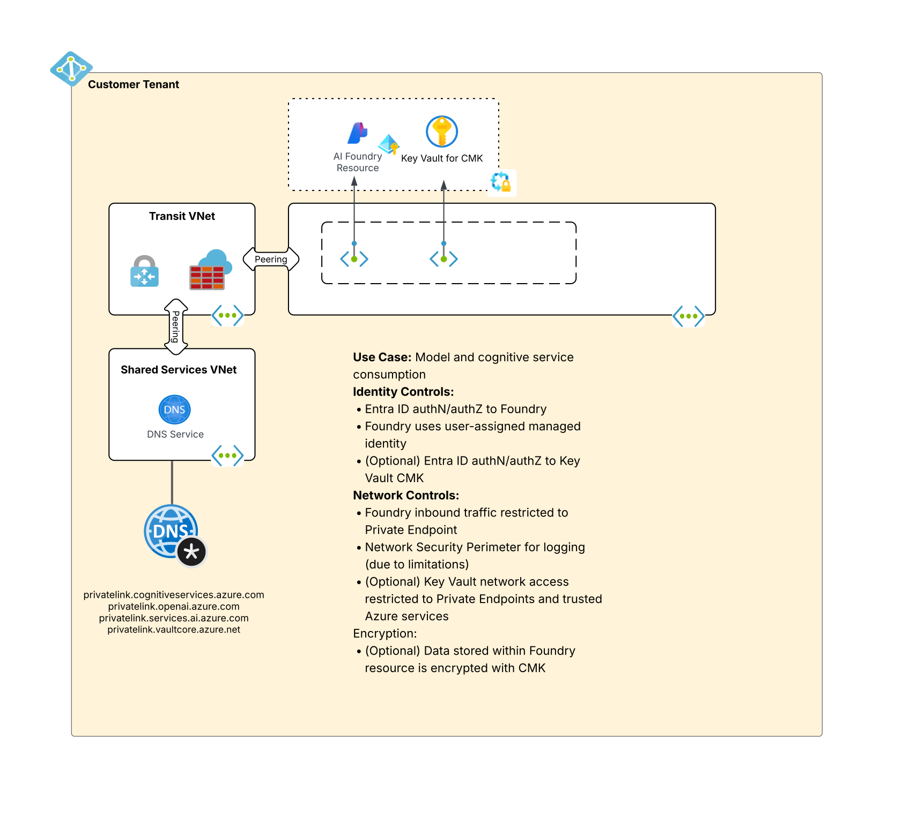
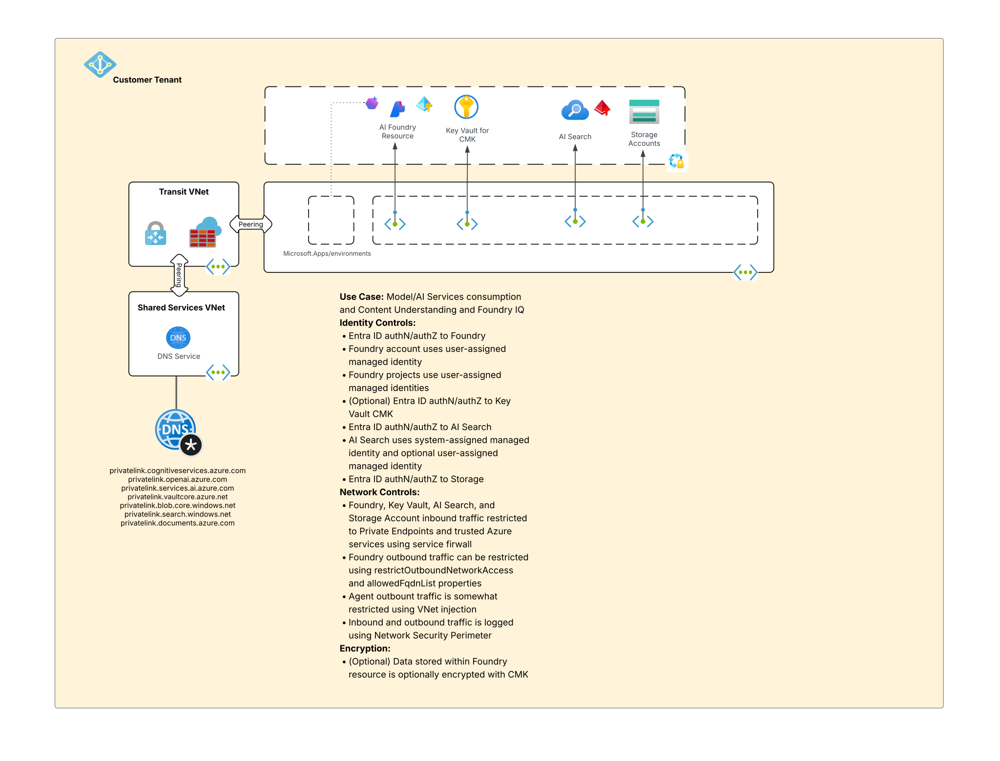
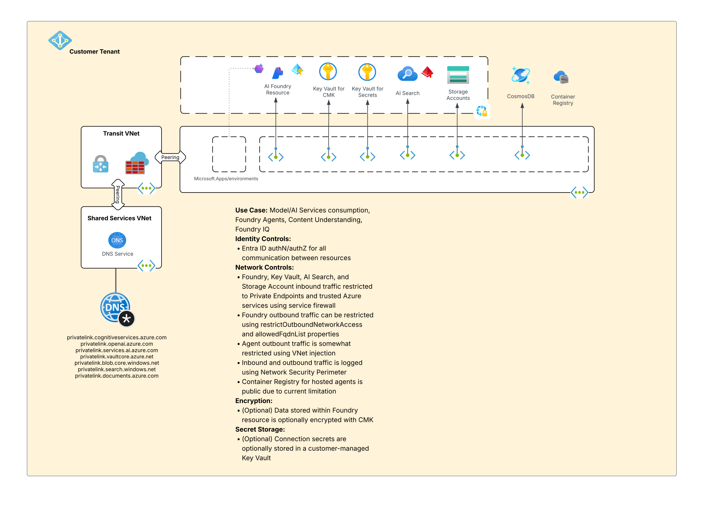
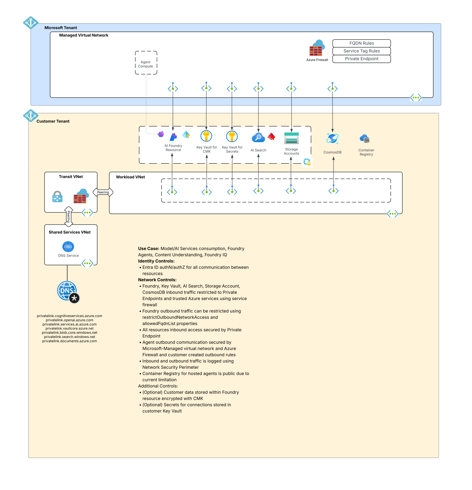

# Microsoft Foundry Workload

## Description

This Terraform can be used in combination with the [base lab](../../README.md) to provision a lab environment to experiment with different Microsoft Foundry designs and architectures. Use cases for this lab include:

1. Demonstrating basic consumption of Microsoft AI Services or models deployed to Foundry.
2. (WIP as of 7/2026) Demonstrating Content Understanding features of Foundry.
3. Demonstrating Foundry agents with [VNet injection](https://learn.microsoft.com/en-us/azure/foundry/agents/how-to/virtual-networks?tabs=portal&pivots=templates) with BYO resources.
4. Demonstration Foundry agents with [Managed VNet](https://learn.microsoft.com/en-us/azure/foundry/how-to/managed-virtual-network?tabs=azure-cli) and BYO resources.
AI was used to help with the format of this README file so if there is an issue blame the many threads of bad Stackoverflow answers and subpar Git repos it scraped during training.

## Table of Contents

- [Updates](#updates)
- [TODOS](#todos)
- [Limitations](#limitations)
- [Architectures](#architectures)
- [Features](#features)
- [Prerequisites](#prerequisites)
- [Variables](#variables)
- [Quick Start](#quick-start)
- [Usage](#usage)

## Updates
* **7/6/2026**
  * Added more detail in comments
  * Added indicators to easily find dependencies. Indicators start with ! like !AGENTS to see resources that are provisioned when doing agent deployment
  * Swapped azapi provider to azurerm for NSPs
  * Updated CMK key size to 4096
  * Changed Grounding for Bing to Grounding for Bing Custom to support advanced WebSearch use cases
  * For agents with managed vnet added outbound rules for CosmosDb, AI Search, ACR, Storage (Blob), Foundry, and FrontDoor.front (supports A365 use cases
  * Updated Cognitive.Service/accounts azapi versions to 2026-05-01 (exempting managedNetwork)
  * Moved secret connection to main resource provisioning template now that bug has been fixed
  * Shifted Application Insights connection to project-level connection
  * Added Key Vault Crypto User to project umi to support CMK when used
* **5/18/2026**
  * Added Terraform module for creating Bot Service to support Foundry Agent publishing to Teams
  * Added Jupyter Notebook that walks programmatic publishing of Foundry Agent
* **5/16/2026**
  * Modified RBAC role from AI User to Foundry User since name was changed recently
* **5/7/2026**
  * Added ACR and ACR connection to support hosted agents
* **3/31/2026**
  * Added required property for managed vnet provisioning
* **3/6/2026**
  * Added connections for AI Gateway
  * Added support for managed virtual network
* **12/29/2025**
  * Initial release

## TODOS
  * Need to do testing to determine Azure RBAC roles and specific network configuration required for Foundry IQ
  * Need to shift NSPs into enforcement mode once Network Security Perimeter Links are available

## Limitations
* 7/26 - Agent VNet injection [does not support CGNAT](https://learn.microsoft.com/en-us/azure/foundry/agents/how-to/virtual-networks?tabs=portal&pivots=templates#limitations)
* 5/26 - Support for VNet injection with Class A IP space [is available in a limited set of regions](https://github.com/microsoft-foundry/foundry-samples/tree/main/infrastructure/infrastructure-setup-bicep/15-private-network-standard-agent-setup)
* 5/26 - CosmosDB support [for Network Security Groups is still preview](https://learn.microsoft.com/en-us/azure/private-link/network-security-perimeter-concepts#onboarded-private-link-resources)

## Architectures
This lab supports variations of the four architectures seen below.

### Standalone


### (7/6/2026 WIP) Content Understanding


### Standard Agent (VNet Injection + BYO Resources)


### Standard Agent (Managed VNet + BYO Resources)


## Features
* Entra ID authentication and Azure RBAC authorization used where available
* Private Endpoints to secure inbound traffic from users and standard agents
* Service Firewall configuration to support service-to-service
* Network Security Perimeter usage to log inbound/outbound traffic
* Agent outbound traffic controlled through VNet injection or managed VNet
* Option to demonstrate customer-managed key encryption for Foundry resource
* Option to demonstrate user-assigned managed identities with Foundry resources and projects
* Option to demonstrate BYO Key Vault for Foundry connection secrets
* Option to demonstrate Content Understanding

## Prerequisites

### Azure Resources
1. **Azure Subscription**: Active subscription with sufficient permissions
2. **Azure Permissions**: `Owner` role or equivalent delegated permissions for:
   - Resource group creation and management
   - Role assignment creation
   - Resource provider activations
   - Resource provisioning
3. **Base Lab**: You must have already deployed the [base lab](../../README.md).

### Local Development Environment
1. **Terraform**: Version 1.10 or higher
   ```bash
   terraform version
   ```

2. **Azure CLI**: Latest version recommended
   ```bash
   az version
   ```

3. **Git**: For cloning the repository
   ```bash
   git --version
   ```

### Required Information
Before deployment, gather the following:

**User Entra ID object ID**: This user is granted various roles to perform common activities that would typically fall under an AI Engineer persona. The exact permissions depend architecture deployed.

## Variables

### Required Variables

| Variable | Type | Description |
|----------|------|-------------|
| `region` | `string` | The name of the Azure region to provision the resources to |
| `region_code` | `string` | The code of the Azure region to provision the resources to |
| `random_string` | `string` | The random string to append to the resource name (alphanumeric, 6 characters or less) |
| `resource_group_name_dns` | `string` | The name of the resource group where the Private DNS Zones exist |
| `subscription_id_infrastructure` | `string` | The subscription where the Private DNS Zones are located |
| `subnet_id_private_endpoints` | `string` | The subnet id to deploy the private endpoints to |
| `user_object_id` | `string` | The Entra ID object id of the user account that should be granted permissions for an AI Engineer-like persona |
| `tags` | `map(string)` | The tags to apply to the resource |
| `trusted_ip` | `string` | The trusted IP address of the Terraform deployment server. Used for Network Security Perimeter access rules when deploying from outside the virtual network |

### Optional Variables

| Variable | Type | Default | Description |
|----------|------|---------|-------------|
| `agents` | `bool` | `false` | Set to true to provision the resources necessary for experimenting with a standard agent configuration. Set to false for standalone or RAG demo deployments |
| `agent_service_outbound_networking` | `object` | `{ type = "none" }` | Configuration for agent service outbound networking. Type must be `vnet_injection`, `managed_virtual_network`, or `none`. When using `vnet_injection`, `subnet_id` must be provided |
| `deploy_key_vault_connection_secrets` | `bool` | `false` | Set to true to create an Azure Key Vault to store secrets for connections used by agents. Only applicable when `agents = true` |
| `deploy_content_understanding` | `bool` | `false` | Set to true to deploy models and resources to help demonstrate Content Understanding |
| `external_openai` | `object` | `null` | Configuration for using models deployed to an existing Azure OpenAI Service instance. Object should contain: `name`, `endpoint`, `resource_id`, and `region` |
| `foundry_encryption` | `string` | `cmk` | Set to `cmk` to create a Key Vault, key, and configure customer-managed key encryption for the Foundry instance. Set to `pmk` to use Microsoft-managed keys. [Review documentation](https://learn.microsoft.com/en-us/azure/ai-foundry/concepts/encryption-keys-portal?view=foundry&preserve-view=true) for regional support |
| `resource_managed_identity_type` | `string` | `umi` | Set to `umi` to configure the Foundry resource to use a user-assigned managed identity. Set to `smi` for system-assigned managed identity |
| `project_managed_identity_type` | `string` | `umi` | Set to `umi` to configure the Foundry project to use a user-assigned managed identity. Set to `smi` for system-assigned managed identity |
| `apim_ai_gateway` | `object` | `null` |
Configuration to setup [BYO model feature](https://learn.microsoft.com/en-us/azure/foundry/agents/how-to/ai-gateway?tabs=api-management&pivots=foundry-portal). See [terraform-sample.tfvars](terraform-sample.tfvars) for example. |
| `model_gateway` | `object`| `null`| Configuration to setup [BYO model feature](https://learn.microsoft.com/en-us/azure/foundry/agents/how-to/ai-gateway?tabs=api-management&pivots=foundry-portal). See [terraform-sample.tfvars](terraform-sample.tfvars) for example. |

## Quick Start

### 1. Clone Repository
```bash
git clone <repository-url>
cd azure-terraform-lab-base-azfw/workloads/microsoft-foundry
```

### 2. Configure Variables

Copy the example configuration:
```bash
cp terraform.tfvars-example terraform.tfvars
```

Edit `terraform.tfvars` with your values. Many of these variables will draw from values of existing resources you deployed with the base lab. See the [Variables](#variables) section above for detailed descriptions of each variable.

## Usage

For deployment:
```bash
terraform apply
```

See the terraform.tfvars-example file for examples on how to configure the different deployment types.