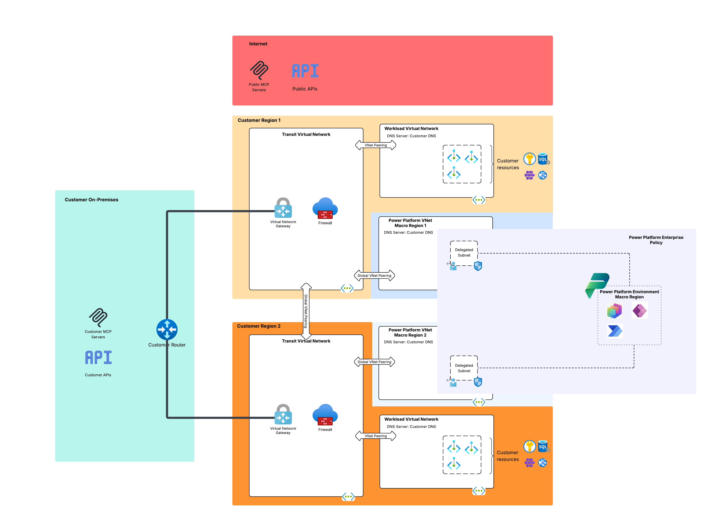
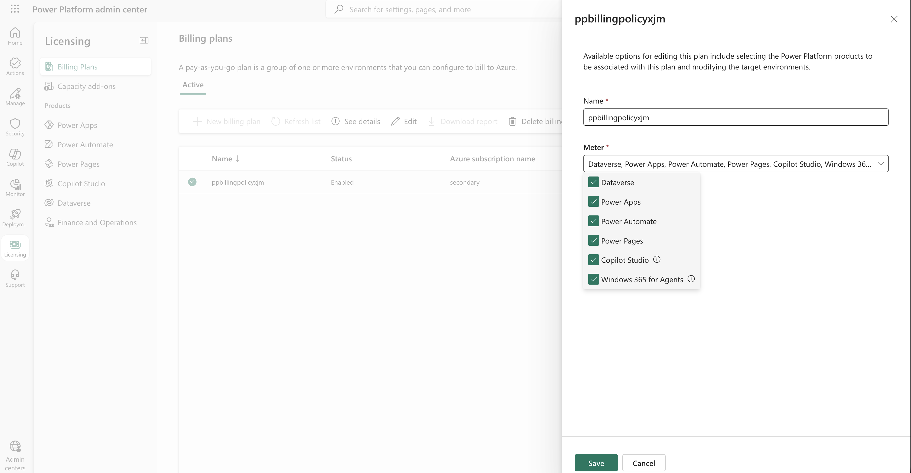
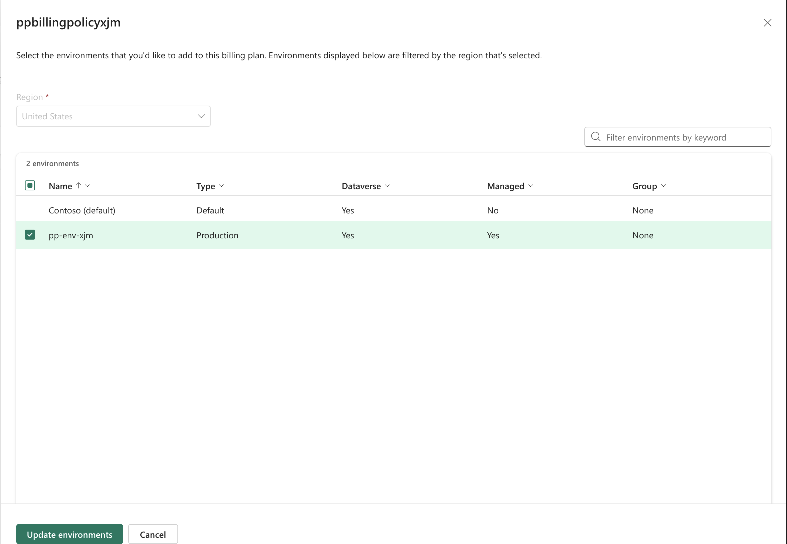

# 0. My stuff

This is a section for me so I remember how to set this whole lab up in 6 months.

## 0.1 Deploy workload vnets and supporting resources

This section will deploy two additional workload virtual networks [based on the template from my base lab](../../images/lab-hub-spoke-azfw-sr.svg) into a new resource group. In addition it will deploy:

* Resource group to store billing policy
* Delegate the snet-app to Microsoft.PowerPlatform/enterprisePolicies

1. First import necessary variables using command below and fill in variables for terraform.tfvars

    ```bash
    entra_credentials=$(security find-generic-password -a 'ms_entra' -s 'terraform' -w | xxd -r -p)
    export ARM_CLIENT_ID=$(echo $entra_credentials | jq -r '.ARM_CLIENT_ID')
    export ARM_CLIENT_SECRET=$(echo $entra_credentials | jq -r '.ARM_CLIENT_SECRET')
    export ARM_TENANT_ID=$(echo $entra_credentials | jq -r '.ARM_TENANT_ID')
    ```

2. Setup Terraform

    ```bash
    cd ./iac/azure
    terraform init
    ```

3. Provision the resources

    ```bash
    terraform apply
    ```

4. Grab outputs and use to populate variables for Power Platform resource deployment.

# 1. Pre-requisites for Setup

## 1.1 Register required Azure resource providers

There are two Azure resource providers that need to be registered to enable this feature. The Microsoft.Network resource provider is required to create the virtual network containing the subnet that will be delegated to the Power Platform service. The Microsoft.PowerPlatform resource provider is required to create Power Platform enterprise policies. Enterprise policies are used to enable the [customer lockbox feature](https://learn.microsoft.com/en-us/power-platform/admin/about-lockbox), [customer managed key](https://learn.microsoft.com/en-us/power-platform/admin/customer-managed-key), and [virtual network support](https://learn.microsoft.com/en-us/power-platform/admin/vnet-support-overview).

Registering a resource provider in an Azure subscription [requires the /register/action permission](https://learn.microsoft.com/en-us/azure/azure-resource-manager/management/resource-providers-and-types). The built-in roles of Owner or Contributor can be used to register both resource providers. Alternatively, the built-in Network Contributor role can be used to register the Microsoft.Network resource provider, but you would need a custom role to register the Microsoft.PowerPlatform resource provider.

You can validate whether the resource providers have been registered in the subscription and register them if not using the az cli commands below. Steps 1 and 2 can be run with an account that has at least Reader permissions.

1. Run the command below to login using az cli and select the subscription you'll be creating the virtual network and enterprise policy in.

    ```bash
    az login
    ```

2. Run the command below to check whether the resource provider is registered. The command will return **Registered** if it is.

    ```bash
    az provider show --namespace 'Microsoft.PowerPlatform'
    az provider show --namespace 'Microsoft.Network'
    ```

3. Run the command below to register the resource providers if they're not registered.

    ```bash
    az provider register --namespace 'Microsoft.PowerPlatform'
    az provider register --namespace 'Microsoft.Network'
    ```

## 1.2 Prepare the virtual networks

Power Platform has its own concepts of regionality (which it refers to as a geography) that differs from what you may be used to in Azure. Within Azure there are often multiple Azure regions within a geography (like the United States) and you pick a region to deploy your Azure resources. When creating a Power Platform environment which will store your apps and optional dataverse, [you pick the geography](https://learn.microsoft.com/en-us/power-platform/admin/business-continuity-disaster-recovery). For example, if I have requirements to deploy my Power Platform applications and data to the United States, I would create an environment in the United States geography. Within the geography, the Power Platform environment is replicated across mulitiple availablity zones within an Azure region in that geography and it can be optionally replicated to a regional pair using [Power Platform's self-service disaster recovery feature](https://learn.microsoft.com/en-us/power-platform/admin/business-continuity-disaster-recovery#cross-region-self-service-disaster-recovery).

The concept of a geography has impact to Power Platform's VNet support. When an environment is configured for VNet support, a virtual network in each Azure region supporting the Power Platform environment needs to be configured. This is [required with all Power Platform environment types](https://learn.microsoft.com/en-us/power-platform/admin/vnet-support-setup-configure?tabs=new%2Csingle&pivots=powershell#clarifications) that allow for VNet support, not just production. These virtual networks should be able to communicate with each other in the event of a Power Platform outage in case resources deployed into the virtual network need to be accessed by Power Platform applications. This communication can be facilitated through a traditional hub and spoke architecture, they do not need to be directly peered.

Within each of the virtual networks Power Platform requires a subnet [be delegated to Microsoft.PowerPlatform/enterprisePolicies](https://learn.microsoft.com/en-us/power-platform/admin/vnet-support-overview). On average, a production environment will use 25-30 IP addresses which means the subnet should be at least a /26. [Multiple environments can share the same delegated subnet](https://learn.microsoft.com/en-us/power-platform/admin/vnet-support-overview) if you configure them for it, so size appropriately.

The virtual network design cloud look like the below.



# 2. Setup Power Platform VNet Support using Terraform

## 2.1 Register the service principal as a Power Platform admin management application

Non-humans, such as identities used by CI/CD pipelines, that need to interact with the Power Platform API can use an Entra ID service principal with the client credentials flow. This access can be used to create Power Platform environments, create enterprise policies, and perform other Power Platform administrative tasks. Before the service principal can interact with the API, it needs to be [registered as a Power Platform admin management application](https://learn.microsoft.com/en-us/power-platform/admin/powerplatform-api-create-service-principal).

The user who performs this task must be hold the Power Platform Administrator or Global Administrator role in Entra ID.

**Note that as of 10/9/2026, this feature is in preview**

To register the application you can run the commands below:

```bash
# Set this to the CI/CD pipeline Service Principal or Managed Identity appId
ENTRA_SP_CLIENT_ID="YOUR_SP_APP_ID"
API_VERSION="2020-10-01"

# Add the service principal as an admin application
az rest --method PUT \
  --uri "https://api.bap.microsoft.com/providers/Microsoft.BusinessAppPlatform/adminApplications/$ENTRA_SP_CLIENT_ID?api-version=$API_VERSION" \
  --resource "https://api.bap.microsoft.com/"

# Verify the registration succeeded
az rest --method GET \
  --uri "https://api.bap.microsoft.com/providers/Microsoft.BusinessAppPlatform/adminApplications?api-version=$API_VERSION" \
  --resource "https://api.bap.microsoft.com/" \
  --query "value[?applicationId=='$ENTRA_SP_CLIENT_ID']"
```

## 2.2 Grant the service principal the Power Platform Owner RBAC role

Once the service principal is added as admin management applciation, it must be granted permissions within Power Platform. Power Platform [supports a small selection of RBAC roles](https://learn.microsoft.com/en-us/power-platform/admin/security/role-based-access-control). For the purposes of this demonstration the service principal will be granted the Power Platform Owner role at the tenant scope. This will give it full permissions over Power Platform, including the ability to create new environments, enterprise policies, and assign other users and applications access.

**Note that as of 10/9/2026, this feature is in preview**

The grant the Power Platform Owner permission to the service prinicpal you run the command below:

```bash
ENTRA_TENANT_ID="YOUR_TENANT_ID"
ENTRA_SP_CLIENT_ID="YOUR_SP_APP_ID"
API_VERSION="2024-10-01"

ROLE_ID="0cb07c69-1631-4725-ab35-e59e001c51ea" # Power Platform Owner
ENTRA_SP_OBJECT_ID=$(az ad sp show --id "$ENTRA_SP_CLIENT_ID" --query id -o tsv)

body=$(cat <<EOF
{
  "roleDefinitionId": "$ROLE_ID",
  "principalObjectId": "$ENTRA_SP_OBJECT_ID",
  "principalType": "ApplicationUser",
  "scope": "/tenants/$ENTRA_TENANT_ID"
}
EOF
)

az rest --method POST \
  --uri "https://api.powerplatform.com/authorization/roleAssignments?api-version=$API_VERSION" \
  --resource "https://api.powerplatform.com/" \
  --headers "Content-Type: application/json" \
  --body "$body"
```

## 2.3 Create the Power Pay-As-You-Go Platform Billing Policy

The [Pay-As-You-Go billing policy](https://learn.microsoft.com/en-us/power-platform/admin/pay-as-you-go-set-up) will associate the Power Platform environment with an Azure resource group in an Azure subscription. Charges for usage of the environment will be invoiced via the Azure subscription. Creation of the billing policy [requires a Power Platform role](https://learn.microsoft.com/en-us/power-platform/admin/pay-as-you-go-set-up#who-can-set-it-up) that can currently only be granted to a human user (as far as I can tell).

In this scenario we will use a user that has been granted the Power Platform Admin role.

To create the billing policy, run the command below:

```bash
BILLING_POLICY_NAME="ppbillingpolicyxjm"
BILLING_SUBSCRIPTION_ID="472cb7fc-cab0-4848-bea7-ad2210ea2c75"
BILLING_RESOURCE_GROUP="rgppbillingxjm"
POWER_PLATFORM_ENVIRONMENT_LOCATION="unitedstates"
API_VERSION="2024-10-01"


body=$(cat <<EOF
{
  "name": "$BILLING_POLICY_NAME",
  "location": "$POWER_PLATFORM_ENVIRONMENT_LOCATION",
  "billingInstrument": {
    "subscriptionId": "$BILLING_SUBSCRIPTION_ID",
    "resourceGroup": "$BILLING_RESOURCE_GROUP"
  }
}
EOF
)

az rest --method POST \
  --uri "https://api.powerplatform.com/licensing/billingPolicies?api-version=$API_VERSION" \
  --resource "https://api.powerplatform.com/" \
  --headers "Content-Type: application/json" \
  --body "$body"
```

The billing policy must be configured to support the necessary meters. At this time (10/26) the API does not support setting the meters. THese meters can be set by a user who holds the Power Platform Admin Role within the Power Platform Admin Center.



## 2.4 Grant the service principal the required Azure roles

The service principal used to provision the Power Platform resources needs specific Azure permissions.

The [Power Platform Enterprise Policy](https://learn.microsoft.com/en-us/azure/templates/microsoft.powerplatform/enterprisepolicies?pivots=deployment-language-terraform) is used to associate the Power Platform environment to subnets in the virtual network in the resources subscription. This forces outbound traffic from supported connectors used by applications in the environment to egress through the delegated subnets. The service principal must have the Read permission over the resource group where the enterprise policy is stored.

To create the necessary role assignment run the command below:

```bash
ENTRA_SP_CLIENT_ID="<service-principal-client-id>"
ENTRA_SP_OBJECT_ID=$(az ad sp show --id "$ENTRA_SP_CLIENT_ID" --query id -o tsv)

RESOURCE_GROUP_ID="RESOURCE GROUP ID CONTAINING ENTERPRISE POLICY"

az role assignment create \
--assignee-object-id "$ENTRA_SP_OBJECT_ID" \
--assignee-principal-type ServicePrincipal \
--role Reader \
--scope "$RESOURCE_GROUP_ID"
```

## 2.5 Provision the Power Platform Resource using Terraform

The [code in this repository](./iac/power-platform/main.tf) can be used to use the [Terraform Power Platform provider](https://registry.terraform.io/providers/microsoft/power-platform/latest). This template will:

* Create a Power Platform Enterprise Policy
* Create a Power Platform Environment
* Make the Power Platform Environment a managed environment
* Associate the Enterprise Policy to the Power Platform Environment

To deploy the template you must:

1. Create a terraform.tfvars file with the necessary variables

2. Initialize the terraform providers

    ```bash
    cd ./iac/power-platform
    terraform init
    ```

3. Provision the resources

    ```bash
    terraform apply
    ```

## 2.6 Associate the environment with the billing policy

As of today (10/26) you cannot associate a billing policy to a Power Platform environment using a non-human because it requires the role of the Power Platform Admin role. The RBAC role of Power Platform Owner is not sufficient.

The policy can be associated to the environment through the Power Platform Admin Portal as seen below.


